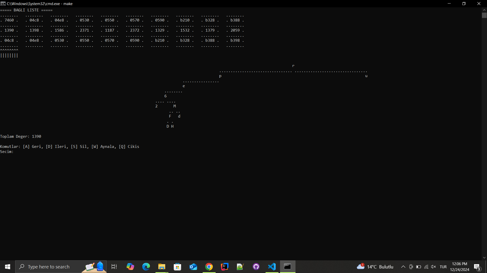
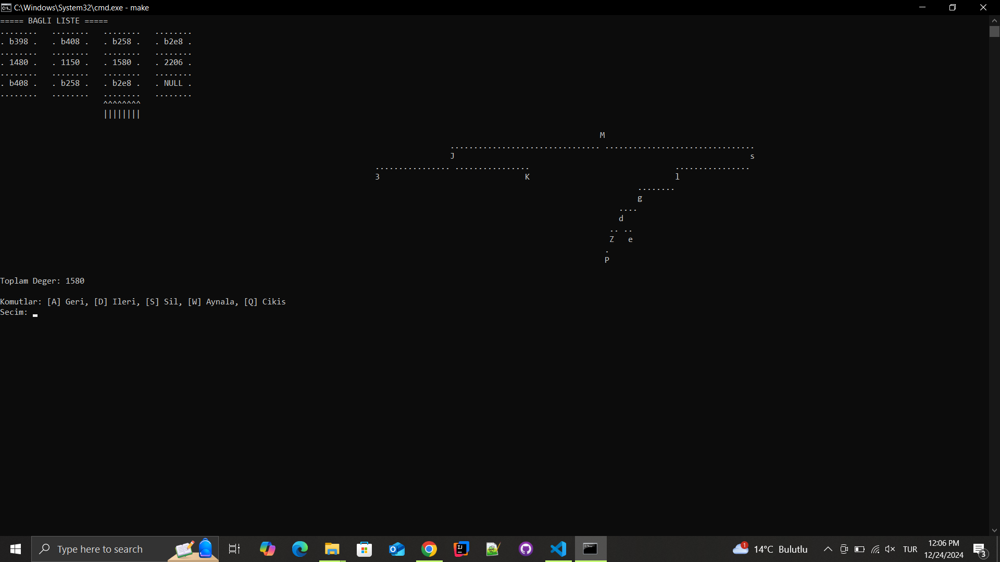

# Project Title: Binary Tree Linked List Visualization

This project is an educational program to visualize a binary tree structure and interact with a linked list of binary trees. The program reads tree data from a text file, constructs binary trees based on ASCII values of characters, and allows various operations such as tree mirroring, node deletion, and navigation within the linked list.

## Features

1. **Binary Tree Construction**: 
   - Each line of the input file creates a binary tree where characters are placed based on their ASCII values.
   - Characters with smaller ASCII values are placed in the left subtree, and larger ASCII values are placed in the right subtree.

2. **Linked List of Trees**:
   - Each binary tree is stored as a node in a singly linked list.
   - The program visualizes and allows navigation through this linked list.

3. **Tree Visualization**:
   - The binary tree is visualized in ASCII format.
   - Nodes are displayed with appropriate spacing, where the bottom level of nodes is closer, and spacing increases as we move up the tree.

4. **Operations**:
   - Navigate through the linked list using `A` (left) and `D` (right).
   - Delete the currently selected node using `S`.
   - Mirror the currently selected binary tree using `W`.
   - Exit the program using `Q`.

## Technologies Used

- **C++**:
  - Core programming language used for the implementation.
- **Object-Oriented Programming**:
  - Classes for `Tree`, `TreeNode`, `LinkedList`, and `ListNode`.
- **Dynamic Memory Management**:
  - Pointers are extensively used to manage nodes in the tree and linked list.
- **File I/O**:
  - Reads input data from a file (`agaclar.txt`).

## File Structure

```
.
├── src/
│   ├── main.cpp        # Main entry point of the program.
│   ├── Tree.cpp        # Binary tree operations.
│   ├── LinkedList.cpp  # Linked list operations.
│   ├── ListNode.cpp    # Linked list node implementation.
│   ├── TreeNode.cpp    # Tree node implementation.
├── include/
│   ├── Tree.h          # Binary tree header file.
│   ├── LinkedList.h    # Linked list header file.
│   ├── ListNode.h      # List node header file.
│   ├── TreeNode.h      # Tree node header file.
├── doc/
│   ├── agaclar.txt     # Input file containing tree data.
├── Makefile            # Build and execution automation.
```

## How to Run the Project

### Prerequisites
- A C++ compiler (e.g., `g++`).
- Make utility installed (optional for manual compilation).

### Steps
1. **Clone the Repository**:
   ```bash
   git clone https://github.com/osmntahir/DATA-STRUCTURES-ASSIGNTMENT-2-2025.git
   cd DATA-STRUCTURES-ASSIGNTMENT-2-2025
   ```

2. **Prepare the Input File**:
   - Ensure the `doc/agaclar.txt` file is in place and contains valid input data.

3. **Build the Project**:
   - Using `make` (recommended):
     ```bash
     make
     ```
   - Manual compilation:
     ```bash
     g++ -c -I "./include" ./src/*.cpp
     g++ ./lib/*.o -o ./bin/program
     ```

4. **Run the Program**:
   ```bash
   ./bin/program
   ```

### Input File Format
- Each line in the `agaclar.txt` file represents a binary tree.
- Example:
  ```
  ABCT
  DEFG
  ```
  This creates two binary trees, one for `ABCT` and another for `DEFG`.

## Program Usage
- `A`: Move to the previous node in the linked list.
- `D`: Move to the next node in the linked list.
- `S`: Delete the currently selected node.
- `W`: Mirror the binary tree of the selected node.
- `Q`: Quit the program.

## Example Output
```
===== BAGLI LISTE =====
  ........   ........   ........   ........   ........
  . 7460 .   . 04c8 .   . 04e8 .   . 0530 .   . 0550 .
  ........   ........   ........   ........   ........
  . 1525 .   . 1132 .   . 1627 .   . 2637 .   . 848  .
  ........   ........   ........   ........   ........

[Secili Dugumun Agaci]
                        P
                ........ ........
                I               m
            ....            .... ....
            B               g       u

Komutlar: [A] Geri, [D] Ileri, [S] Sil, [W] Aynala, [Q] Cikis
```




## Notes
- The program handles dynamic memory allocation and deallocation carefully to prevent memory leaks.
- Make sure the input file is correctly formatted to avoid runtime errors.


Feel free to explore the code and suggest improvements!
